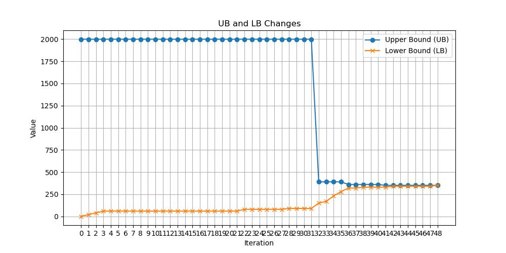

# 说明
在这个例子中，我们对下面这个例子使用了benders decomposition方法。

An example of Benders Decomposition on fixed charge transportation
problem bk4x3.
Optimal objective in reference : 350.
Erwin Kalvelagen, December 2002
See:
http://www.in.tu-clausthal.de/~gottlieb/benchmarks/fctp/

其中，FCTP master problem直接建模求解。

FCTP benders decomposition使用benders方法求解，通过callback求解。

FCTP benders cycle version分别构建两个model求解，没有通过callback求解。

# 1. $\hat{y}=\mathbf{0}$

## 迭代情况

supply = [10, 30, 40, 20], 

demand = [20, 50, 30]

fixed cost = \[[10, 30, 20],[10, 30, 20], [10, 30, 20]]

transport cost = \[[2.0, 3.0, 4.0], [3.0, 2.0, 1.0], [1.0, 4.0, 3.0], [4.0, 5.0, 2.0]]

初始化UB = 1999, LB = 1

第0次，

$$\hat{y} = [0,0,0,0,0,0,0,0,0,0,0,0]$$
feasibility cut, 
$$
100.0 -10.0*y_{11} -10.0*y_{12} -10.0*y_{13} -20.0*y_{21} -30.0*y_{22} -30.0*y_{23}\\ -20.0*y_{31} -40.0*y_{32} -30.0*y_{33} -20.0*y_{41} -20.0*y_{42} -20.0*y_{43} <= 0
$$

 

第1次，
$$y = [0.0, 0.0, 0.0, 0.0, 0.0, 1.0, 1.0, 0.0, 1.0, 1.0, 0.0, 0.0]$$

其中，

$$y_{23} = 1.0, \\
y_{31} = 1.0,\\
y_{33} = 1.0,\\
y_{41} = 1.0
$$

feasibility cut, 
$$
50.0 -10.0*y_{12} -30.0*y_{22} -40.0*y_{32} -20.0*y_{42} <= 0
$$

第2次，
$$y = [0.0, 0.0, 0.0, -0.0, 1.0, 0.0, 1.0, 1.0, -0.0, 1.0, 0.0, -0.0]$$

其中，

$$y_{22} = 1.0, \\
y_{31} = 1.0,\\
y_{32} = 1.0,\\
y_{41} = 1.0
$$

feasibility cut, 
$$
30.0 -10.0*y_{13} -30.0*y_{23} -30.0*y_{33} -20.0*y_{43} <= 0
$$

第3次，
$$y = [0.0, 0.0, 0.0, 0.0, 1.0, -0.0, -0.0, 1.0, 1.0, 0.0, 0.0, 0.0]$$

其中，

$$y_{22} = 1.0, \\
y_{32} = 1.0,\\
y_{33} = 1.0
$$

feasibility cut, 
$$
30.0 -10.0*y_{13} -30.0*y_{23} -30.0*y_{33} -20.0*y_{43} <= 0
$$

第4次，
$$y = [0.0, 0.0, 0.0, 0.0, 0.0, -0.0, -0.0, 1.0, 1.0, 1.0, 1.0, 0.0]$$
其中，
$$
y_{32} = 1.0,\\
y_{33} = 1.0,\\
y_{41} = 1.0,\\
y_{42} = 1.0,
$$
feasibility cut, 
$$
40.0 -10.0*y_{11} -10.0*y_{12} -10.0*y_{13} -20.0*y_{21} -30.0*y_{22} -30.0*y_{23} <= 0
$$

第5次，
$$y = [0.0, 1.0, 0.0, 0.0, 0.0, 1.0, 0.0, 1.0, 0.0, 1.0, 0.0, 0.0]$$
其中，
$$
y_{12} = 1.0,\\
y_{23} = 1.0,\\
y_{32} = 1.0,\\
y_{41} = 1.0,
$$
optimality cut, 
$$
490.0 -20.0*y_{11} -40.0*y_{12} -20.0*y_{13} -20.0*y_{21} -150.0*y_{22} \\ -150.0*y_{23} -40.0*y_{42} -80.0*y_{43} <= q
$$

第6次，
$$y = [1.0, 1.0, 0.0, 1.0, 1.0, 1.0, 0.0, 0.0, 0.0, 0.0, 1.0, 1.0]$$
其中，
$$
y_{11} = 1.0\\
y_{12} = 1.0\\
y_{21} = 1.0\\
y_{22} = 1.0\\
y_{23} = 1.0\\
y_{42} = 1.0\\
y_{43} = 1.0
$$
feasibility cut, 
$$
490.0 -20.0*y_{11} -40.0*y_{12} -20.0*y_{13} -20.0*y_{21} -150.0*y_{22} \\ -150.0*y_{23} -40.0*y_{42} -80.0*y_{43} <= q
$$

第7次，
$$y = [1.0, 1.0, 1.0, 1.0, 1.0, 1.0, 0.0, 1.0, 0.0, 0.0, 0.0, 1.0]$$
其中，
$$
y_{11} = 1.0\\
y_{12} = 1.0\\
y_{13} = 1.0\\
y_{21} = 1.0\\
y_{22} = 1.0\\
y_{23} = 1.0\\
y_{32} = 1.0\\\
y_{43} = 1.0
$$
optimality cut, 
$$
300.0 -20.0*y_{11} -80.0*y_{31} <= q
$$

第8次，
$$y = [1.0, 0.0, 0.0, 0.0, 1.0, 1.0, 1.0, 1.0, 0.0, 1.0, 0.0, 0.0]$$
其中，
$$
y_{11} = 1.0\\
y_{22} = 1.0\\
y_{23} = 1.0\\
y_{31} = 1.0\\
y_{32} = 1.0\\
y_{41} = 1.0
$$
feasibility cut, 
$$
10.0 -10.0*y_{12} -10.0*y_{13} -20.0*y_{42} -20.0*y_{43} <= 0
$$

第9次，
$$y = [1.0, 0.0, 0.0, 0.0, 1.0, 1.0, 1.0, 1.0, 0.0, 0.0, 0.0, 1.0]$$
其中，
$$
y_{11} = 1.0\\
y_{22} = 1.0\\
y_{23} = 1.0\\
y_{31} = 1.0\\
y_{32} = 1.0\\
y_{43} = 1.0
$$
optimality cut, 
$$
320.0 -20.0*y_{12} -40.0*y_{42} -80.0*y_{43} <= q
$$

第10次，
$$y = [1.0, 0.0, 0.0, 0.0, 0.0, 1.0, 1.0, 1.0, 0.0, 0.0, 1.0, 1.0]$$
其中，
$$
y_{11} = 1.0\\
y_{23} = 1.0\\
y_{31} = 1.0\\
y_{32} = 1.0\\
y_{42} = 1.0\\
y_{43} = 1.0
$$
optimality cut, 
$$
280.0 -20.0*y_{12} -60.0*y_{22} <= q
$$

第11次，
$$y = [1.0, 0.0, 0.0, 0.0, 1.0, 0.0, 1.0, 0.0, 1.0, 0.0, 1.0, 1.0]$$
其中，
$$
y_{11} = 1.0\\
y_{22} = 1.0\\
y_{31} = 1.0\\
y_{33} = 1.0\\
y_{42} = 1.0\\
y_{43} = 1.0
$$
optimality cut, 
$$
340.0 -40.0*y_{12} -60.0*y_{22} -80.0*y_{32} <= q
$$

第12次，
$$y = [0.0, 0.0, 1.0, 0.0, 1.0, 0.0, 1.0, 1.0, 0.0, 0.0, 0.0, 1.0]$$
其中，
$$
y_{13} = 1.0\\
y_{22} = 1.0\\
y_{31} = 1.0\\
y_{32} = 1.0\\
y_{43} = 1.0
$$
optimality cut, 
$$
240.0 -20.0*y_{12} <= q
$$

第13次，
$$y = [0.0, 0.0, 1.0, 0.0, 1.0, 0.0, 1.0, 1.0, 0.0, 0.0, 0.0, 1.0]$$
其中，
$$
y_{13} = 1.0\\
y_{22} = 1.0\\
y_{31} = 1.0\\
y_{32} = 1.0\\
y_{43} = 1.0
$$

optimal solution found.

## 上下界变化图

# 2. 部分$\hat{y}=\mathbf{1}$的迭代

假定我们给定的$y$如下所示：
$$\hat{y} = [0,0,0, 0,1,0, 0,0,1, 0,1,0]$$,

那么上下界变化如下所示：

上界在第九次迭代才更新，即子问题在第九次才找到optimal solution，说明初始化时，不同的$y$影响后面生成cut的质量。

# 3. 不同$M_{ij}$的影响

直观上理解，子问题约束3右侧的$M_{ij}$越紧越好，从不等式上来说，$M_{ij}$越小越好，那么这个影响有多大呢？可以通过实验看下效果。
在构建子问题时，通过分析需求量与供应量，$M_{ij}=min\{c_{ij}, d_{ij}\}, \forall i \in S, \forall j \in D$，如果我们直接取$M_{ij}=50$,

上界在第32次才被更新，这从侧面说明在构面模型时，更紧的约束可以减少求解的时间。